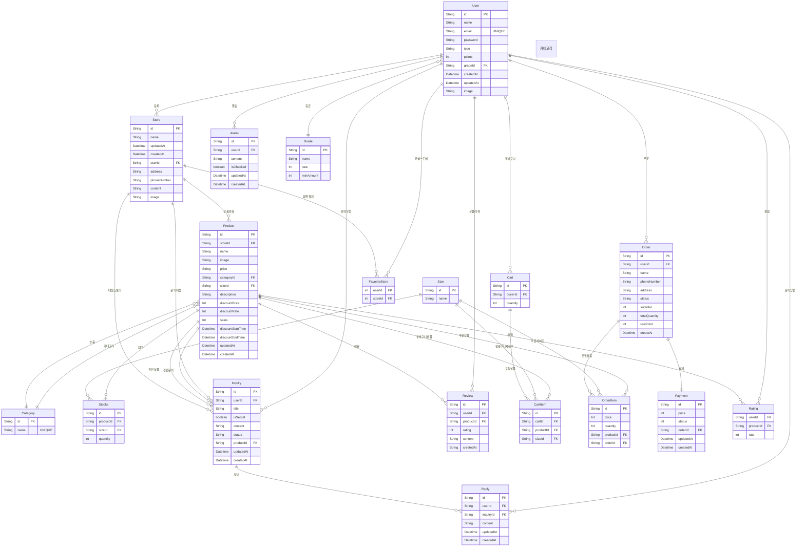

```mermaid
erDiagram
User {
  String id PK
  String name
  String email "UNIQUE"
  String password
  String type
  int points
  String gradeId FK
  Datetime createdAt
  Datetime updatedAt
  String image
}

Store {
  String id PK
  String name
  Datetime updatedAt
  Datetime createdAt
  String userId FK
  String address
  String phoneNumber
  String content
  String image
}

Product{
 String id PK
 String storeId FK
 String name
 String image
 String price
 String categoryId FK
 String sizeId FK
 String description
 Int discountPrice
 Int discountRate
 Int sales
 Datetime discountStartTime
 Datetime discountEndTime
 Datetime updatedAt
 Datetime createdAt
}

Category{
  String id PK
  String name "UNIQUE"
}

Stocks{
   String id PK
   String productId FK
   String sizeId FK
   int quantity
}

Size{
  String id PK
  String name
}

Inquiry{
  String id PK
  String userId FK
  String title
  boolean isSecret
  String content
  String status
  String productId FK
  Datetime updatedAt
  Datetime createdAt
}

Reply{
  String id PK
  String userId FK
  String inquiryId FK
  String content
  Datetime updatedAt
  Datetime createdAt
}

Review {
  String id PK
  String userId FK
  String productId FK
  Int rating
  String content
  String createdAt
}

Cart{
  String id PK
  String buyerId FK
  Int quantity
}

CartItem{
  String id PK
  String cartId FK
  String productId FK
  String sizeId FK
}

Order{
  String id PK
  String userId FK
  String name
  String phoneNumber
  String address
  String status
  Int subtotal
  Int totalQuantity
  Int usePoint
  Datetime createAt
}

OrderItem{
  String id PK
  Int price
  Int quantity
  String productId FK
  String orderId FK
}

Payment{
  String id PK
  Int price
  Int status
  String orderId FK
  Datetime updatedAt
  Datetime createdAt
}

Alarm{
  String id PK
  String userId FK
  String content
  boolean isChecked
  Datetime updatedAt
  Datetime createdAt
}


Grade{
  String id PK
  String name
  Int rate
  Int minAmount
}

FavoriteStore {
    int userId FK
    int storeId FK
}

Rating{
  String userId FK
  String productId FK
  int rate
}

User ||--o{ Store : 등록
User ||--o{ FavoriteStore : 관심스토어
User ||--o{ Inquiry : 문의작성
User ||--o{ Reply : 문의답변
User ||--o{ Review : 상품리뷰
User ||--o{ Cart : 장바구니
User ||--o{ Order : 주문
User ||--o{ Alarm : 알림
User ||--o{ Rating : 평점

User }o--|| Grade : 등급

Store ||--o{ Product : 상품보유
Store ||--o{ FavoriteStore : 찜한유저
Store ||--o{ Inquiry : 문의대상

Product ||--o{ Stocks : 재고
Product ||--o{ Inquiry : 관련문의
Product ||--o{ Review : 리뷰
Product ||--o{ CartItem : 장바구니상품
Product ||--o{ OrderItem : 주문상품
Product ||--o{ Rating : 평점

Product }o--|| Category : 카테고리

Size ||--o{ Stocks : 재고
Size ||--o{ CartItem : 장바구니사이즈
Size ||--o{ OrderItem : 주문사이즈

Cart ||--o{ CartItem : 구성상품

Order ||--o{ OrderItem : 포함상품
Order ||--|| Payment : 결제

Inquiry ||--o{ Reply : 답변
Inquiry }o--|| Product : 관련상품
Inquiry }o--|| Store : 대상스토어

Category ||--o{ Product : 상품 카테고리

```
